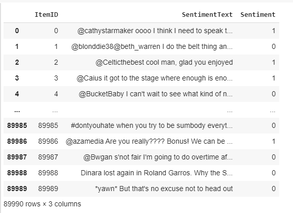
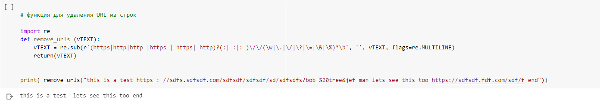
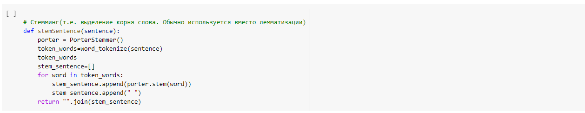
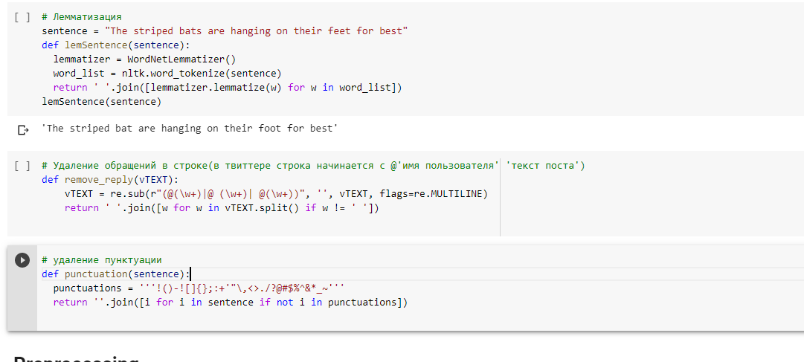
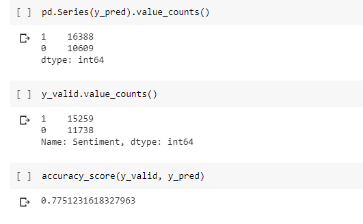

# Introduction

Hello! This is going to be a notebook, in which i have described my solution for `TWITTER SENTIMENT ANALYSIS`.

# The idea and implementation

**1 STEP**

There is a task for understanding whether the text desribes good things or bad ones. And this task is called sentiment-analysis. There are a lot of messages in twitter and the company Twitter needs to make relevant ones to show them. They do not want to provide offending messages. 

To solve this task i have dataset with two columns. In the first one described text of messages and in the second one described class (1 - relevant message, 0 - not relevant message)

Here is how the dataset looks like:

****2 STEP****

Now i am going to preprocess raw text and make it more understandable for computer. To do this, i am going to delete some symbols and puncuation. Also i am going to use lemmatization.

`Deleting url`

`Stemming`

`Lemma, reply and punctuation`

**3 STEP**

To vectorize my data i am going to use `Tf-idf vectorizer`. It is a strange mechanism to vectorize sentences in corpus. And there is how it works:

**4 STEP** 

The model i am going to use is `Logistic regression`.

**5 STEP**

The distribution of final answers and final score are pretty cool:

**6 STEP**

The submitting is described in notebook and it is not the most interesting thing.

# Conclusion

I have done my twitter sentiment analysis algorythm and it works with accuracy 78%. 

Thank you for your attention!
